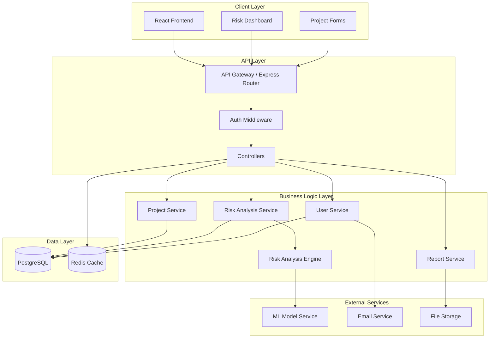

# Design Document: AI Project Risk Analyzer

## Overview

The AI Project Risk Analyzer is a full-stack web application that leverages machine learning to predict and analyze project risks. The system follows a three-tier architecture with a React-based frontend, Node.js/Express backend, and PostgreSQL database. The core innovation is the Risk Analysis Engine, which uses a combination of rule-based logic and machine learning models to evaluate project parameters and generate risk predictions.

The application is designed for scalability, maintainability, and extensibility, with clear separation between the presentation layer, business logic, and data persistence. Authentication is handled via JWT tokens, and the API follows RESTful principles for easy integration with external tools.

## Architecture

### High-Level Architecture



### Technology Stack

**Frontend:**
- React 18+ with TypeScript
- React Router for navigation
- Recharts for data visualization
- Axios for API communication
- Tailwind CSS for styling
- React Query for state management and caching

**Backend:**
- Node.js 18+ with Express.js
- TypeScript for type safety
- JWT for authentication
- Bcrypt for password hashing
- Joi for request validation
- Winston for logging

**Database:**
- PostgreSQL 14+ for relational data
- Redis for caching and session management

**AI/ML:**
- Python-based ML service (separate microservice)
- Scikit-learn for risk prediction models
- TensorFlow/Keras for advanced models (future)

**DevOps:**
- Docker for containerization
- Docker Compose for local development
- Environment-based configuration

## Components and Interfaces

### Frontend Components

#### 1. Authentication Components

**LoginForm**
- Purpose: Handle user login
- Props: `onSuccess: () => void`
- State: `email: string, password: string, error: string | null, loading: boolean`
- Methods:
  - `handleSubmit(e: FormEvent): Promise<void>` - Validates and submits credentials
  - `validateEmail(email: string): boolean` - Client-side email validation

**RegisterForm**
- Purpose: Handle user registration
- Props: `onSuccess: () => void`
- State: `name: string, email: string, password: string, confirmPassword: string, error: string | null`
- Methods:
  - `handleSubmit(e: FormEvent): Promise<void>` - Validates and submits registration
  - `validatePassword(password: string): boolean` - Ensures password meets requirements

#### 2. Project Management Components

**ProjectList**
- Purpose: Display all user projects
- Props: `userId: string`
- State: `projects: Project[], loading: boolean, error: string | null`
- Methods:
  - `fetchProjects(): Promise<void>` - Retrieves projects from API
  - `handleDelete(projectId: string): Promise<void>` - Deletes a project
  - `handleEdit(projectId: string): void` - Navigates to edit view

**ProjectForm**
- Purpose: Create or edit project details
- Props: `projectId?: string, onSuccess: () => void`
- State: `formData: ProjectFormData, errors: ValidationErrors, loading: boolean`
- Methods:
  - `handleSubmit(): Promise<void>` - Validates and saves project
  - `validateDates(): boolean` - Ensures end date is after start date
  - `validateBudget(): boolean` - Ensures budget is positive

#### 3. Risk Analysis Components

**RiskDashboard**
- Purpose: Main dashboard for risk visualization
- Props: `projectId: string`
- State: `riskData: RiskAnalysis, loading: boolean, selectedCategory: RiskCategory | null`
- Methods:
  - `fetchRiskAnalysis(): Promise<void>` - Retrieves risk analysis
  - `handleCategoryFilter(category: RiskCategory): void` - Filters risks by category
  - `handleRefresh(): Promise<void>` - Triggers new analysis

**RiskCard**
- Purpose: Display individual risk details
- Props: `risk: Risk, onMitigationUpdate: (riskId: string, mitigation: Mitigation) => void`
- Methods:
  - `getSeverityColor(score: number): string` - Returns color based on score
  - `handleMarkImplemented(mitigationId: string): Promise<void>` - Marks mitigation as done

**RiskChart**
- Purpose: Visualize risk distribution
- Props: `risks: Risk[], chartType: 'category' | 'severity' | 'timeline'`
- Methods:
  - `prepareChartData(): ChartData` - Transforms risk data for visualization
  - `renderChart(): JSX.Element` - Renders appropriate chart type

### Backend Services

#### 1. User Service

```typescript
interface UserService {
  // Create new user account
  register(userData: RegisterDTO): Promise<User>
  
  // Authenticate user and return JWT
  login(credentials: LoginDTO): Promise<AuthResponse>
  
  // Verify JWT token
  verifyToken(token: string): Promise<User>
  
  // Initiate password reset
  requestPasswordReset(email: string): Promise<void>
  
  // Complete password reset
  resetPassword(token: string, newPassword: string): Promise<void>
  
  // Get user by ID
  getUserById(userId: string): Promise<User>
  
  // Update user profile
  updateUser(userId: string, updates: Partial<User>): Promise<User>
}
```

#### 2. Project Service

```typescript
interface ProjectService {
  // Create new project
  createProject(userId: string, projectData: CreateProjectDTO): Promise<Project>
  
  // Get all projects for a user
  getUserProjects(userId: string): Promise<Project[]>
  
  // Get single project by ID
  getProjectById(projectId: string, userId: string): Promise<Project>
  
  // Update project details
  updateProject(projectId: string, userId: string, updates: UpdateProjectDTO): Promise<Project>
  
  // Delete project and associated data
  deleteProject(projectId: string, userId: string): Promise<void>
  
  // Validate project ownership
  validateOwnership(projectId: string, userId: string): Promise<boolean>
}
```

#### 3. Risk Analysis Service

```typescript
interface RiskAnalysisService {
  // Perform risk analysis on a project
  analyzeProject(projectId: string): Promise<RiskAnalysis>
  
  // Get latest analysis for a project
  getLatestAnalysis(projectId: string): Promise<RiskAnalysis>
  
  // Get historical analyses
  getAnalysisHistory(projectId: string): Promise<RiskAnalysis[]>
  
  // Compare two analyses
  compareAnalyses(analysisId1: string, analysisId2: string): Promise<AnalysisComparison>
  
  // Add custom mitigation strategy
  addMitigation(riskId: string, mitigation: CreateMitigationDTO): Promise<Mitigation>
  
  // Mark mitigation as implemented
  markMitigationImplemented(mitigationId: string): Promise<Mitigation>
  
  // Update risk status
  updateRiskStatus(riskId: string, status: RiskStatus): Promise<Risk>
}
```

#### 4. Risk Analysis Engine

```typescript
interface RiskAnalysisEngine {
  // Main analysis method
  analyze(project: Project): Promise<RiskPrediction[]>
  
  // Calculate overall project risk score
  calculateOverallScore(risks: Risk[]): number
  
  // Generate mitigation strategies
  generateMitigations(risk: Risk, project: Project): Mitigation[]
  
  // Categorize risk
  categorizeRisk(riskDescription: string, context: ProjectContext): RiskCategory
  
  // Score individual risk
  scoreRisk(riskFactors: RiskFactors): number
}
```

**Risk Analysis Engine Implementation Strategy:**

The engine uses a hybrid approach:

1. **Rule-Based Analysis**: Evaluates known risk patterns
   - Timeline compression (end date - start date < industry average)
   - Budget constraints (budget < estimated cost)
   - Team experience gaps (junior ratio > 50%)
   - Technology maturity (new/unproven tech stack)

2. **ML-Based Prediction**: Uses trained models for complex patterns
   - Historical project data for similar projects
   - Feature extraction from project parameters
   - Risk probability and impact prediction

3. **Scoring Algorithm**:
   ```
   Risk_Score = (Probability × 0.5 + Impact × 0.5) × 100
   
   Where:
   - Probability: 0.0 to 1.0 (likelihood of occurrence)
   - Impact: 0.0 to 1.0 (severity if it occurs)
   ```

#### 5. Report Service

```typescript
interface ReportService {
  // Generate PDF report
  generatePDFReport(projectId: string, options: ReportOptions): Promise<Buffer>
  
  // Generate CSV export
  generateCSVExport(projectId: string): Promise<string>
  
  // Save report to storage
  saveReport(report: Buffer, metadata: ReportMetadata): Promise<string>
  
  // Get report download URL
  getReportURL(reportId: string): Promise<string>
}
```

### API Endpoints

#### Authentication Endpoints

```
POST   /api/auth/register          - Register new user
POST   /api/auth/login             - Login user
POST   /api/auth/refresh           - Refresh JWT token
POST   /api/auth/forgot-password   - Request password reset
POST   /api/auth/reset-password    - Reset password with token
GET    /api/auth/verify            - Verify JWT token
```

#### Project Endpoints

```
POST   /api/projects               - Create new project
GET    /api/projects               - Get all user projects
GET    /api/projects/:id           - Get project by ID
PUT    /api/projects/:id           - Update project
DELETE /api/projects/:id           - Delete project
```

#### Risk Analysis Endpoints

```
POST   /api/projects/:id/analyze           - Trigger risk analysis
GET    /api/projects/:id/risks             - Get latest risk analysis
GET    /api/projects/:id/risks/history     - Get analysis history
GET    /api/risks/:id                      - Get specific risk details
POST   /api/risks/:id/mitigations          - Add custom mitigation
PUT    /api/mitigations/:id/implement      - Mark mitigation implemented
PUT    /api/risks/:id/status               - Update risk status
```

#### Report Endpoints

```
POST   /api/projects/:id/reports/pdf       - Generate PDF report
POST   /api/projects/:id/reports/csv       - Generate CSV export
GET    /api/reports/:id/download           - Download report
```

## Data Models

### User Model

```typescript
interface User {
  id: string                    // UUID
  email: string                 // Unique, validated email
  passwordHash: string          // Bcrypt hashed password
  name: string                  // User's full name
  createdAt: Date              // Account creation timestamp
  updatedAt: Date              // Last update timestamp
  lastLoginAt: Date | null     // Last successful login
  isVerified: boolean          // Email verification status
  resetToken: string | null    // Password reset token
  resetTokenExpiry: Date | null // Reset token expiration
}
```

**Database Schema:**
```sql
CREATE TABLE users (
  id UUID PRIMARY KEY DEFAULT gen_random_uuid(),
  email VARCHAR(255) UNIQUE NOT NULL,
  password_hash VARCHAR(255) NOT NULL,
  name VARCHAR(255) NOT NULL,
  created_at TIMESTAMP DEFAULT CURRENT_TIMESTAMP,
  updated_at TIMESTAMP DEFAULT CURRENT_TIMESTAMP,
  last_login_at TIMESTAMP,
  is_verified BOOLEAN DEFAULT FALSE,
  reset_token VARCHAR(255),
  reset_token_expiry TIMESTAMP
);

CREATE INDEX idx_users_email ON users(email);
```

### Project Model

```typescript
interface Project {
  id: string                    // UUID
  userId: string                // Foreign key to User
  name: string                  // Project name
  description: string           // Project description
  startDate: Date              // Project start date
  endDate: Date                // Project end date
  budget: number               // Project budget (USD)
  teamSize: number             // Number of team members
  teamComposition: TeamMember[] // Team roles and experience
  technologyStack: Technology[] // Technologies used
  scope: string                // Project scope description
  createdAt: Date              // Creation timestamp
  updatedAt: Date              // Last update timestamp
}

interface TeamMember {
  role: string                 // e.g., "Developer", "Designer"
  count: number                // Number of people in this role
  experienceLevel: 'Junior' | 'Mid' | 'Senior'
}

interface Technology {
  name: string                 // Technology name
  category: 'Frontend' | 'Backend' | 'Database' | 'DevOps' | 'Other'
  maturity: 'Stable' | 'Emerging' | 'Experimental'
}
```

**Database Schema:**
```sql
CREATE TABLE projects (
  id UUID PRIMARY KEY DEFAULT gen_random_uuid(),
  user_id UUID NOT NULL REFERENCES users(id) ON DELETE CASCADE,
  name VARCHAR(255) NOT NULL,
  description TEXT,
  start_date DATE NOT NULL,
  end_date DATE NOT NULL,
  budget DECIMAL(15, 2) NOT NULL,
  team_size INTEGER NOT NULL,
  team_composition JSONB NOT NULL,
  technology_stack JSONB NOT NULL,
  scope TEXT,
  created_at TIMESTAMP DEFAULT CURRENT_TIMESTAMP,
  updated_at TIMESTAMP DEFAULT CURRENT_TIMESTAMP,
  CONSTRAINT valid_dates CHECK (end_date > start_date),
  CONSTRAINT positive_budget CHECK (budget > 0)
);

CREATE INDEX idx_projects_user_id ON projects(user_id);
CREATE INDEX idx_projects_created_at ON projects(created_at);
```

### Risk Analysis Model

```typescript
interface RiskAnalysis {
  id: string                    // UUID
  projectId: string             // Foreign key to Project
  overallScore: number          // Overall project risk score (0-100)
  analyzedAt: Date             // Analysis timestamp
  risks: Risk[]                // Array of identified risks
  metadata: AnalysisMetadata   // Analysis configuration and version
}

interface Risk {
  id: string                    // UUID
  analysisId: string            // Foreign key to RiskAnalysis
  title: string                 // Risk title
  description: string           // Detailed risk description
  category: RiskCategory        // Risk category
  score: number                 // Risk score (0-100)
  probability: number           // Probability (0.0-1.0)
  impact: number               // Impact (0.0-1.0)
  status: RiskStatus           // Current status
  mitigations: Mitigation[]    // Mitigation strategies
  detectedAt: Date             // When risk was first detected
  resolvedAt: Date | null      // When risk was resolved
}

type RiskCategory = 'Technical' | 'Resource' | 'Schedule' | 'Budget' | 'External'
type RiskStatus = 'Open' | 'In Progress' | 'Mitigated' | 'Resolved' | 'Accepted'

interface Mitigation {
  id: string                    // UUID
  riskId: string                // Foreign key to Risk
  strategy: string              // Mitigation strategy description
  priority: 'High' | 'Medium' | 'Low'
  estimatedEffort: string       // e.g., "2 days", "1 week"
  isImplemented: boolean        // Implementation status
  implementedAt: Date | null    // Implementation timestamp
  isCustom: boolean            // User-added vs AI-generated
  createdAt: Date              // Creation timestamp
}

interface AnalysisMetadata {
  modelVersion: string          // ML model version used
  engineVersion: string         // Analysis engine version
  processingTime: number        // Time taken (milliseconds)
  dataCompleteness: number      // Percentage of required data present
}
```

**Database Schema:**
```sql
CREATE TABLE risk_analyses (
  id UUID PRIMARY KEY DEFAULT gen_random_uuid(),
  project_id UUID NOT NULL REFERENCES projects(id) ON DELETE CASCADE,
  overall_score DECIMAL(5, 2) NOT NULL,
  analyzed_at TIMESTAMP DEFAULT CURRENT_TIMESTAMP,
  metadata JSONB NOT NULL,
  CONSTRAINT valid_score CHECK (overall_score >= 0 AND overall_score <= 100)
);

CREATE TABLE risks (
  id UUID PRIMARY KEY DEFAULT gen_random_uuid(),
  analysis_id UUID NOT NULL REFERENCES risk_analyses(id) ON DELETE CASCADE,
  title VARCHAR(255) NOT NULL,
  description TEXT NOT NULL,
  category VARCHAR(50) NOT NULL,
  score DECIMAL(5, 2) NOT NULL,
  probability DECIMAL(3, 2) NOT NULL,
  impact DECIMAL(3, 2) NOT NULL,
  status VARCHAR(50) NOT NULL,
  detected_at TIMESTAMP DEFAULT CURRENT_TIMESTAMP,
  resolved_at TIMESTAMP,
  CONSTRAINT valid_risk_score CHECK (score >= 0 AND score <= 100),
  CONSTRAINT valid_probability CHECK (probability >= 0 AND probability <= 1),
  CONSTRAINT valid_impact CHECK (impact >= 0 AND impact <= 1)
);

CREATE TABLE mitigations (
  id UUID PRIMARY KEY DEFAULT gen_random_uuid(),
  risk_id UUID NOT NULL REFERENCES risks(id) ON DELETE CASCADE,
  strategy TEXT NOT NULL,
  priority VARCHAR(50) NOT NULL,
  estimated_effort VARCHAR(100),
  is_implemented BOOLEAN DEFAULT FALSE,
  implemented_at TIMESTAMP,
  is_custom BOOLEAN DEFAULT FALSE,
  created_at TIMESTAMP DEFAULT CURRENT_TIMESTAMP
);

CREATE INDEX idx_risk_analyses_project_id ON risk_analyses(project_id);
CREATE INDEX idx_risk_analyses_analyzed_at ON risk_analyses(analyzed_at);
CREATE INDEX idx_risks_analysis_id ON risks(analysis_id);
CREATE INDEX idx_risks_category ON risks(category);
CREATE INDEX idx_risks_score ON risks(score DESC);
CREATE INDEX idx_mitigations_risk_id ON mitigations(risk_id);
```

### Report Model

```typescript
interface Report {
  id: string                    // UUID
  projectId: string             // Foreign key to Project
  analysisId: string            // Foreign key to RiskAnalysis
  type: 'PDF' | 'CSV'          // Report type
  fileUrl: string              // Storage URL
  generatedAt: Date            // Generation timestamp
  generatedBy: string          // User ID who generated
  options: ReportOptions       // Report configuration
}

interface ReportOptions {
  includeSummary: boolean
  includeDetailedRisks: boolean
  includeCharts: boolean
  includeMitigations: boolean
  includeHistory: boolean
}
```

**Database Schema:**
```sql
CREATE TABLE reports (
  id UUID PRIMARY KEY DEFAULT gen_random_uuid(),
  project_id UUID NOT NULL REFERENCES projects(id) ON DELETE CASCADE,
  analysis_id UUID NOT NULL REFERENCES risk_analyses(id) ON DELETE CASCADE,
  type VARCHAR(10) NOT NULL,
  file_url TEXT NOT NULL,
  generated_at TIMESTAMP DEFAULT CURRENT_TIMESTAMP,
  generated_by UUID NOT NULL REFERENCES users(id),
  options JSONB NOT NULL
);

CREATE INDEX idx_reports_project_id ON reports(project_id);
CREATE INDEX idx_reports_generated_at ON reports(generated_at);
```


## Correctness Properties

A property is a characteristic or behavior that should hold true across all valid executions of a system—essentially, a formal statement about what the system should do. Properties serve as the bridge between human-readable specifications and machine-verifiable correctness guarantees.

### Authentication and Authorization Properties

**Property 1: User registration creates valid accounts**
*For any* valid registration data (email, password, name), creating a user account should result in a stored user record with hashed password and a verification email queued for sending.
**Validates: Requirements 1.1, 1.6**

**Property 2: Valid credentials produce valid tokens**
*For any* registered user with valid credentials, authentication should produce a valid JWT token that can be verified and grants access to protected resources.
**Validates: Requirements 1.2, 1.3**

**Property 3: Token lifecycle is enforced**
*For any* JWT token, if the token is expired, access to protected resources should be denied and require re-authentication.
**Validates: Requirements 1.4**

**Property 4: Password reset generates secure tokens**
*For any* registered email address, requesting password reset should generate a unique reset token and queue a reset email.
**Validates: Requirements 1.5**

**Property 5: Data isolation is enforced**
*For any* two different users, one user should never be able to access or modify another user's projects or risk analyses.
**Validates: Requirements 1.7, 2.3**

### Project Management Properties

**Property 6: Project data round-trips correctly**
*For any* valid project data (including team composition and technology stack), creating a project and then retrieving it should return equivalent data with all nested structures preserved.
**Validates: Requirements 2.1, 2.7, 2.8, 9.1**

**Property 7: Project updates are persisted**
*For any* existing project and valid update data, updating the project should persist the changes and update the last modified timestamp to be greater than the previous timestamp.
**Validates: Requirements 2.2**

**Property 8: Input validation rejects invalid data**
*For any* project data where end date is before or equal to start date, or budget is non-positive, the system should reject the data and return a validation error.
**Validates: Requirements 2.5, 2.6, 9.2**

**Property 9: Cascading deletion removes all related data**
*For any* project or user, deleting the entity should remove all associated data (projects, risk analyses, mitigations) with no orphaned records remaining.
**Validates: Requirements 2.4, 9.6, 9.7**

### Risk Analysis Properties

**Property 10: Valid projects produce risk analyses**
*For any* project with complete required data, requesting risk analysis should produce a RiskAnalysis object with at least one identified risk.
**Validates: Requirements 3.1**

**Property 11: Risk analysis output structure is valid**
*For any* completed risk analysis, all risks should have scores between 0-100, valid categories (Technical, Resource, Schedule, Budget, External), and at least one mitigation strategy.
**Validates: Requirements 3.2, 3.3, 3.4, 5.1**

**Property 12: Incomplete projects return descriptive errors**
*For any* project missing required fields, requesting risk analysis should return an error message that specifically identifies which fields are missing.
**Validates: Requirements 3.5**

**Property 13: Projects can be re-analyzed**
*For any* project that has been analyzed, updating the project and requesting re-analysis should produce a new RiskAnalysis with a later timestamp.
**Validates: Requirements 3.7, 5.5**

**Property 14: Risks are sorted by score**
*For any* risk analysis with multiple risks, retrieving the risks should return them sorted by Risk_Score in descending order by default.
**Validates: Requirements 4.2**

**Property 15: Risk filtering is accurate**
*For any* risk category filter, all returned risks should have exactly that category, and the count should match the number of risks returned.
**Validates: Requirements 4.4, 4.5**

**Property 16: Overall risk score is calculated correctly**
*For any* risk analysis with multiple risks, the overall project risk score should be a weighted average of individual risk scores, bounded between 0-100.
**Validates: Requirements 4.6**

**Property 17: Mitigation strategies are prioritized**
*For any* risk with multiple mitigation strategies, the mitigations should be ordered by priority (High, Medium, Low).
**Validates: Requirements 5.6**

**Property 18: Status updates include timestamps**
*For any* mitigation or risk status update, marking it as implemented or resolved should set the corresponding timestamp to the current time and update the status field.
**Validates: Requirements 5.3, 7.5**

**Property 19: Custom mitigations are stored**
*For any* risk and user-provided mitigation strategy, adding a custom mitigation should store it with isCustom=true and associate it with the correct risk.
**Validates: Requirements 5.4**

### Dashboard and Metrics Properties

**Property 20: Dashboard metrics are accurate**
*For any* project with risk analysis, the dashboard metrics (total risks, high-priority risks, mitigated risks, open risks) should match the actual counts from the risk data.
**Validates: Requirements 6.6**

### Historical Tracking Properties

**Property 21: Analyses are stored with timestamps**
*For any* risk analysis performed, the analysis should be stored in the database with a timestamp, and retrieving it should return the same data.
**Validates: Requirements 7.1**

**Property 22: History is chronologically ordered**
*For any* project with multiple analyses, retrieving the analysis history should return all analyses sorted by timestamp in ascending order (oldest first).
**Validates: Requirements 7.2**

**Property 23: Analysis comparison shows differences**
*For any* two different risk analyses for the same project, comparing them should return the differences in overall score, risk counts, and individual risk score changes.
**Validates: Requirements 7.3**

**Property 24: Resolution metrics are calculated correctly**
*For any* set of resolved risks, the average time to resolution should equal the sum of (resolved_at - detected_at) divided by the count of resolved risks.
**Validates: Requirements 7.6**

### Report Generation Properties

**Property 25: PDF reports contain all required data**
*For any* risk analysis, generating a PDF report should produce a document containing project details, all risks with scores and categories, and all mitigation strategies.
**Validates: Requirements 8.1, 8.3**

**Property 26: CSV export round-trips correctly**
*For any* risk analysis, exporting to CSV and parsing the CSV should produce data equivalent to the original risk analysis structure.
**Validates: Requirements 8.4**

**Property 27: Report options are respected**
*For any* report generation request with specific options (include/exclude sections), the generated report should contain only the requested sections.
**Validates: Requirements 8.5**

**Property 28: Report download URLs are generated**
*For any* generated report, the system should return a valid download URL that can be used to retrieve the report file.
**Validates: Requirements 8.7**

### API and Error Handling Properties

**Property 29: HTTP status codes are correct**
*For any* API request, the response should have the appropriate status code: 200/201 for success, 400 for validation errors, 401 for authentication errors, 404 for not found, 500 for server errors.
**Validates: Requirements 10.2, 12.6**

**Property 30: JSON serialization round-trips correctly**
*For any* API request/response with JSON data, serializing an object to JSON and deserializing it should produce an equivalent object.
**Validates: Requirements 10.3**

**Property 31: Malformed requests return descriptive errors**
*For any* malformed API request (invalid JSON, missing required fields, invalid auth), the system should return a 400 or 401 error with a message describing the specific problem.
**Validates: Requirements 10.4, 10.5**

**Property 32: Errors are logged**
*For any* error that occurs in the system, an error log entry should be created with timestamp, error type, message, and stack trace.
**Validates: Requirements 12.2**

**Property 33: Service unavailability is handled gracefully**
*For any* request when the AI service is unavailable, the system should return an error response indicating the service is unavailable and suggesting retry timing.
**Validates: Requirements 12.7**

## Error Handling

### Error Categories

The system implements comprehensive error handling across four categories:

1. **Validation Errors (400)**
   - Invalid input data (dates, budget, email format)
   - Missing required fields
   - Data constraint violations
   - Example: `{ error: "ValidationError", message: "End date must be after start date", field: "endDate" }`

2. **Authentication Errors (401)**
   - Invalid credentials
   - Expired or invalid JWT tokens
   - Missing authentication headers
   - Example: `{ error: "AuthenticationError", message: "Invalid or expired token" }`

3. **Authorization Errors (403)**
   - Attempting to access another user's resources
   - Insufficient permissions
   - Example: `{ error: "AuthorizationError", message: "You do not have permission to access this project" }`

4. **Server Errors (500)**
   - Database connection failures
   - AI service unavailability
   - Unexpected exceptions
   - Example: `{ error: "ServerError", message: "An unexpected error occurred", requestId: "uuid" }`

### Error Handling Strategy

**Frontend Error Handling:**
- Display user-friendly error messages
- Highlight form fields with validation errors
- Provide retry mechanisms for transient failures
- Log errors to monitoring service

**Backend Error Handling:**
- Catch all exceptions at route level
- Log detailed error information (stack traces, context)
- Return consistent error response format
- Implement circuit breakers for external services
- Use database transactions to prevent inconsistent state

**Error Response Format:**
```typescript
interface ErrorResponse {
  error: string           // Error type/category
  message: string         // User-friendly message
  details?: any          // Additional error details
  field?: string         // Field name for validation errors
  requestId?: string     // Unique request ID for tracking
  timestamp: string      // ISO 8601 timestamp
}
```

### Retry and Recovery

- **Transient Failures**: Implement exponential backoff for retries
- **AI Service Unavailable**: Queue requests and process when service recovers
- **Database Failures**: Use connection pooling and automatic reconnection
- **Rate Limiting**: Return 429 status with Retry-After header

## Testing Strategy

### Dual Testing Approach

The AI Project Risk Analyzer requires both unit testing and property-based testing to ensure comprehensive correctness:

**Unit Tests** focus on:
- Specific examples of correct behavior
- Edge cases (empty projects, single risk, maximum values)
- Error conditions (invalid inputs, service failures)
- Integration points between components
- Authentication flows with specific credentials
- Report generation with specific data

**Property-Based Tests** focus on:
- Universal properties that hold for all inputs
- Data integrity across random inputs
- Round-trip properties (serialization, database operations)
- Invariants (score ranges, data isolation)
- Comprehensive input coverage through randomization

### Property-Based Testing Configuration

**Testing Library**: We will use **fast-check** for JavaScript/TypeScript property-based testing.

**Configuration**:
- Minimum 100 iterations per property test
- Each test must reference its design document property
- Tag format: `// Feature: ai-project-risk-analyzer, Property {number}: {property_text}`

**Example Property Test Structure**:
```typescript
import fc from 'fast-check';

describe('Property 6: Project data round-trips correctly', () => {
  // Feature: ai-project-risk-analyzer, Property 6: Project data round-trips correctly
  it('should preserve all project data through create and retrieve', () => {
    fc.assert(
      fc.property(
        projectArbitrary(), // Generator for random valid projects
        async (projectData) => {
          const created = await projectService.createProject(userId, projectData);
          const retrieved = await projectService.getProjectById(created.id, userId);
          
          expect(retrieved.name).toBe(projectData.name);
          expect(retrieved.budget).toBe(projectData.budget);
          expect(retrieved.teamComposition).toEqual(projectData.teamComposition);
          expect(retrieved.technologyStack).toEqual(projectData.technologyStack);
        }
      ),
      { numRuns: 100 }
    );
  });
});
```

### Test Organization

**Unit Tests**:
```
tests/
  unit/
    services/
      userService.test.ts
      projectService.test.ts
      riskAnalysisService.test.ts
      reportService.test.ts
    controllers/
      authController.test.ts
      projectController.test.ts
      riskController.test.ts
    utils/
      validation.test.ts
      jwt.test.ts
```

**Property Tests**:
```
tests/
  properties/
    authentication.property.test.ts
    projectManagement.property.test.ts
    riskAnalysis.property.test.ts
    dataIntegrity.property.test.ts
    api.property.test.ts
```

**Integration Tests**:
```
tests/
  integration/
    api/
      auth.integration.test.ts
      projects.integration.test.ts
      risks.integration.test.ts
    database/
      cascading.integration.test.ts
      transactions.integration.test.ts
```

### Test Data Generators

For property-based testing, we need generators (arbitraries) for:

- **Valid Users**: Random emails, passwords, names
- **Valid Projects**: Random dates (end > start), positive budgets, team compositions, tech stacks
- **Risk Analyses**: Random risks with valid scores (0-100), categories, mitigations
- **JWT Tokens**: Valid and expired tokens
- **API Requests**: Valid and malformed JSON payloads

### Coverage Goals

- **Unit Test Coverage**: Minimum 80% code coverage
- **Property Test Coverage**: All 33 correctness properties implemented
- **Integration Test Coverage**: All API endpoints and database operations
- **Edge Case Coverage**: Empty data, boundary values, maximum sizes

### Continuous Testing

- Run unit tests on every commit
- Run property tests on every pull request
- Run integration tests before deployment
- Monitor test execution time (property tests may be slower due to iterations)
